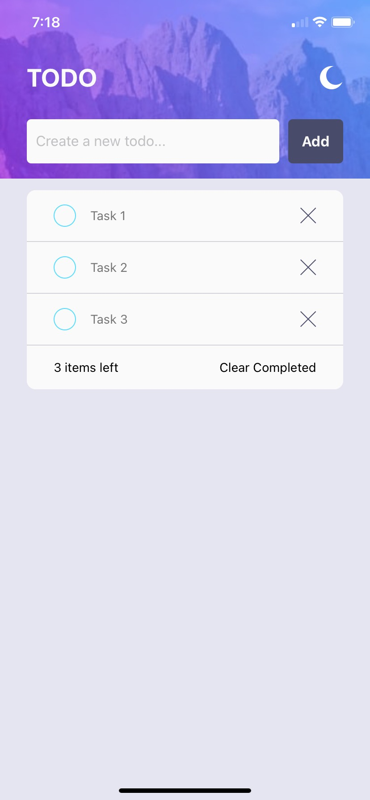
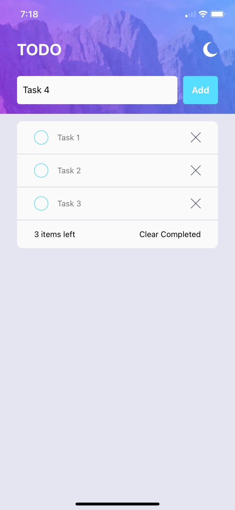
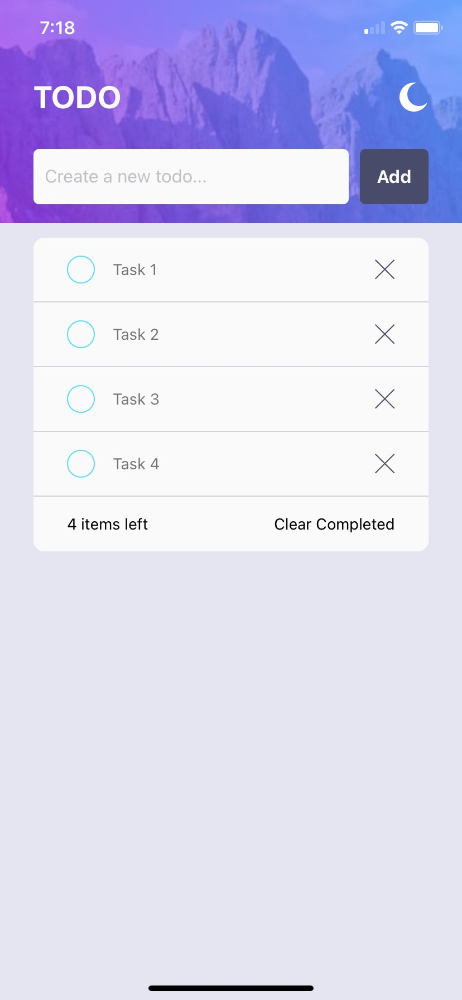
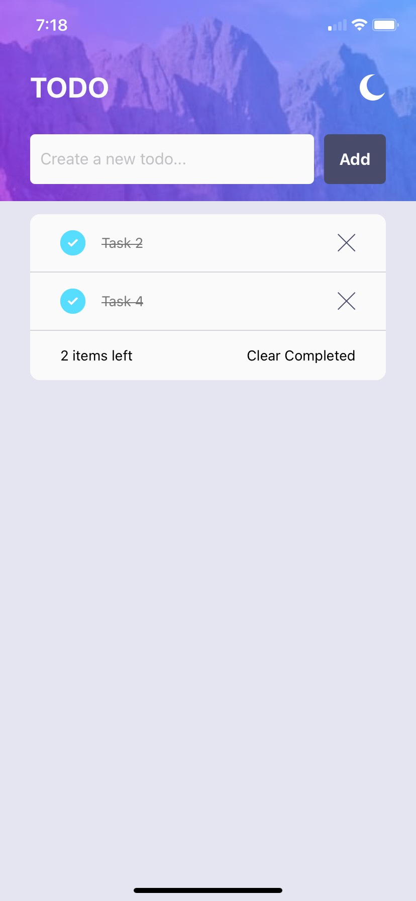

# ToDo App

This Todo application is a simple tool designed to help you manage your tasks efficiently and organized. Developed using React Native, this application offers an intuitive and user-friendly interface for managing your to-do lists. This project was part of a challenge from Frontend Mentor.

## Demo
<div style="display: flex">
  
  
  
  
</div>

## Features
### Task Management
- Easily add, edit, and delete tasks.
- Mark tasks as completed when finished.

### Organization
- Organize your tasks by categories or priorities for better management.
- Filter and search tasks to quickly find what you need.

### Customization
- Customize the appearance and style of your to-do list according to your preferences.

## Technologies Used
- React Native
- Expo
- TypeScript

## Installation

1. Clone the repository
```
git clone https://github.com/AGuardiola20/todo-react-native
```

2. Change to the project directory
```
cd todo-app-react-native
```

3. Install dependencies
```
npm install
```

4. Start the application
```
npx expo start
```
